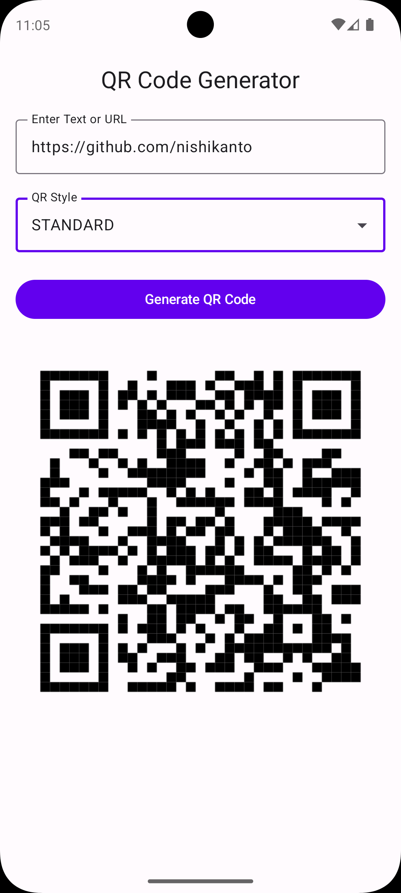
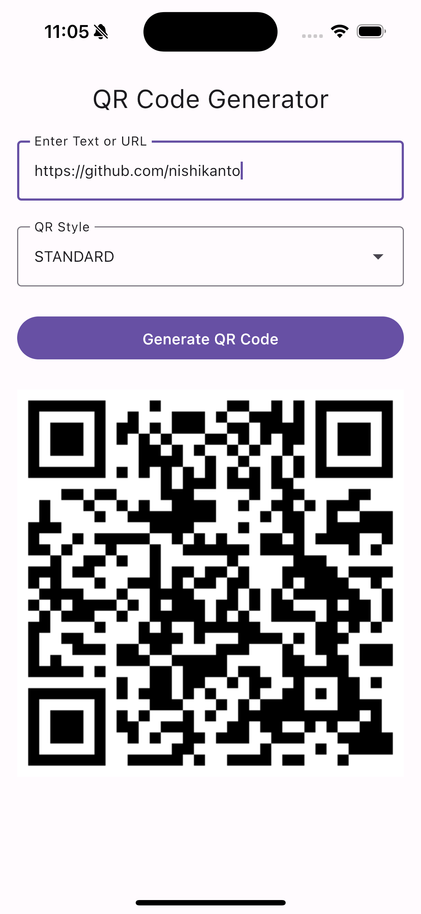

# QrStudioKMP 🧩

A Kotlin Multiplatform QR Code Generator built with Jetpack Compose Multiplatform.

## ✨ Features

- ✅ Android: Styled QR generation using ZXing
- ✅ iOS: QR generation using CoreImage + Skia
- ✅ Shared UI: Jetpack Compose Material 3
- ✅ Multiplatform support (Android + iOS)
- ✅ Written entirely in Kotlin

## 📸 Screenshots

| Android UI | iOS UI |
|------------|--------|
|  |  |

## 🛠️ How to Build

### Android

```bash
./gradlew :androidApp:installDebug
```

### iOS

```bash
cd iosApp
open iosApp.xcworkspace
```

Run via Xcode on iPhone simulator.

## 📚 Tech Stack

- Kotlin Multiplatform
- Jetpack Compose Multiplatform
- ZXing (Android)
- CoreImage (iOS)
- Skia → Compose UI image bridge

## 🪪 License

[MIT](LICENSE)
